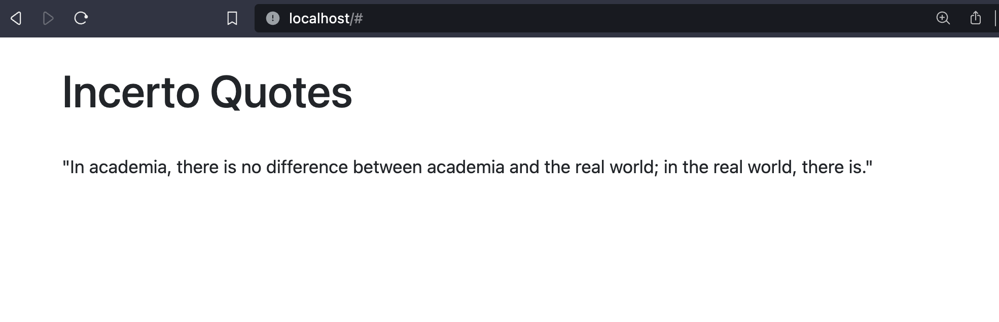

# Incerto Quotes

The "Incerto" series by Nassim Nicholas Taleb, a collection of books focused on randomness, probability, uncertainty, and how these concepts affect our lives and decision-making, is rich with thought-provoking and often witty quotes.

This repository contains code to deploy a Kubernetes based flask web application for quotes from one of my favorite book series - Incerto by NNT.

## Requirements

* Install Kubernetes, kubectl, minikube and flask

## Overview

### 1. Develop a Web Application

* Refer `app.py`

### 2. Dockerize the Application

* `docker build -t incerto-quote-app .`
* `docker tag incerto-quote-app pyaf/incerto-quote-app:v1`
* `docker push pyaf/incerto-quote-app:v1`

### 3. Create Kubernetes Deployment and Service

* Refer to `deployment.yaml` and `service.yaml`

### 4. Deploy on Kubernetes Cluster

* Ensure that the kubernetes cluster is running. If you are using Minikube - `minikube start`
* Deployment: `kubectl apply -f deployment.yaml`
* Start Service: `kubectl apply -f service.yaml`

### Access

* Start Minikube tunnel: `minikube tunnel`, visit `http://localhost`

### Screenshot

